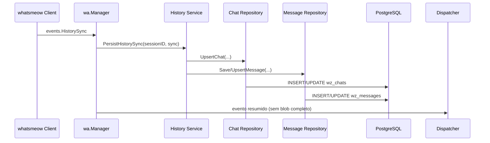

## Context

O WZAP já persiste mensagens em `wz_messages` por meio de `engine.SetMessagePersist(historySvc.PersistMessage)` e `messageSvc.SetMessagePersist(historySvc.PersistMessage)`, ligados em `internal/server/router.go`. No fluxo atual, `internal/wa/events.go` chama `OnMessageReceived` para `*events.Message`, mas para `*events.HistorySync` apenas registra logs e publica um resumo do evento (`syncType`, `chunkOrder`, `progress`, `conversationCount`) para webhook/NATS.

O código real do `whatsmeow` usado pelo projeto (`go.mau.fi/whatsmeow v0.0.0-20260327181659-02ec817e7cf4`) mostra que `events.HistorySync` encapsula `waHistorySync.HistorySync`, que contém `Conversations []*Conversation`, `Pushnames`, `PhoneNumberToLIDMapping` e mensagens históricas completas em `Conversation.Messages []*HistorySyncMsg`, cada uma com `Message *waWeb.WebMessageInfo`. O `sqlstore` da lib persiste `whatsmeow_contacts` e `whatsmeow_chat_settings`, mas essas tabelas fazem parte da infraestrutura da lib e não representam um modelo de produto próprio do WZAP.

Hoje há três lacunas: não existe uma tabela canônica de chats do domínio, o conteúdo completo do `HistorySync` não é persistido, e `internal/integrations/chatwoot/service.go` ainda mantém `importHistory` como placeholder. A mudança precisa preparar a base canônica sem alterar o contrato resumido de webhook/NATS nem depender diretamente do schema interno do `whatsmeow`.

## Goals / Non-Goals

**Goals:**
- Introduzir uma camada canônica de chats no banco do WZAP, separada das tabelas `whatsmeow_*`
- Persistir dados relevantes de `HistorySync` em `wz_chats` e `wz_messages`
- Consolidar, no mesmo modelo canônico, dados vindos do fluxo live e do histórico bootstrap
- Registrar metadados de ingestão suficientes para reprocessamento e import futuro para Chatwoot
- Preservar a entrega resumida de eventos para webhook/NATS, evitando payloads grandes

**Non-Goals:**
- Implementar nesta change o replay completo para Chatwoot
- Substituir o `sqlstore` do `whatsmeow` ou alterar sua responsabilidade de sessão/protocolo
- Expor novos endpoints HTTP nesta etapa
- Enviar o blob bruto de `HistorySync` para webhook, WebSocket ou NATS

## Decisions

### Decisão 1: criar armazenamento canônico próprio no WZAP

**Escolhida.** A mudança introduz `wz_chats` como tabela nova do domínio e amplia `wz_messages` com metadados de origem. O WZAP continuará usando `whatsmeow_*` apenas como infraestrutura da biblioteca.

**Motivo:** o schema interno da lib cobre sessão, contatos e chat settings, mas não oferece um modelo de produto estável para import, relatórios e reprocessamento. A camada canônica desacopla a evolução do WZAP da evolução do `whatsmeow`.

**Alternativa descartada:** consultar diretamente `whatsmeow_contacts` e `whatsmeow_chat_settings` como fonte principal. Isso acoplaria o domínio do WZAP ao schema da dependência.

### Decisão 2: adicionar callback explícito para `HistorySync` no `wa.Manager`

**Escolhida.** O `Manager` ganhará um callback específico para ingestão de `*events.HistorySync`, análogo a `OnMessageReceived` e `OnMediaReceived`.

**Motivo:** o fluxo atual em `internal/wa/events.go` já resolve mensagens live separadamente. O `HistorySync` precisa de tratamento próprio porque entrega blobs com múltiplas conversas e chunks ordenáveis.

**Alternativa descartada:** reaproveitar o payload resumido publicado pelo dispatcher. Isso perde as mensagens reais e os metadados de conversa necessários para persistência canônica.

### Decisão 3: reutilizar `wz_messages` para histórico, com upsert idempotente

**Escolhida.** Mensagens do `HistorySync` e do fluxo live continuarão na mesma tabela `wz_messages`, com novos campos de rastreabilidade (`source`, `source_sync_type`, `history_chunk_order`, `imported_to_chatwoot_at` ou equivalente).

**Motivo:** o projeto já usa `wz_messages` para histórico consultável e integração com Chatwoot. Reusar a tabela evita duplicação de modelo e simplifica a idempotência usando a chave atual `(id, session_id)`.

**Alternativa descartada:** criar tabela separada apenas para histórico bootstrap. Isso complicaria o import futuro e a reconciliação com mensagens live.

### Decisão 4: consolidar chat metadata por upsert em `wz_chats`

**Escolhida.** Cada chat identificado por `session_id + chat_jid` será atualizado tanto por `HistorySync.Conversation` quanto por mensagens live, preservando o melhor conjunto de metadados disponível.

**Campos previstos:** nome/display name, tipo do chat, flags como archived/pinned/read_only, unread_count, last_message_at, aliases de JID, raw do histórico, source e timestamps.

**Alternativa descartada:** inferir chats sempre em tempo de leitura a partir de `wz_messages`. Isso não cobre flags, nomes e estado de conversa com confiabilidade.

### Decisão 5: manter webhook/NATS com payload resumido

**Escolhida.** O evento publicado continuará resumido, respeitando o limite já codificado de 512 KB em `internal/wa/events.go`.

**Motivo:** o `HistorySync` pode conter múltiplas conversas e mensagens completas; enviar o blob pelo broker aumentaria risco de falhas e acoplamento desnecessário. A persistência completa ocorre localmente.

### Decisão 6: evoluir `HistoryService` para ingestão canônica

**Escolhida.** O serviço atual de persistência de mensagens será ampliado para suportar:
- persistência de mensagem live
- upsert de chat
- ingestão de chunks de `HistorySync`
- normalização de aliases de JID (`PN`/`LID`) quando disponíveis

**Fluxo de dados proposto:**

## Risks / Trade-offs

- **Duplicidade entre live e history sync** → usar upsert idempotente por `(session_id, message_id)` e preservar campos mais completos no conflito
- **Diferença entre `LID` e `PN`** → armazenar aliases e usar mapeamentos do `whatsmeow` quando disponíveis
- **Chunks fora de ordem** → persistir `chunkOrder`, `syncType` e timestamps para reprocessamento determinístico
- **Aumento de custo de armazenamento** → manter `raw` apenas onde agrega valor operacional e evitar replicar blobs inteiros desnecessariamente fora de `raw`
- **Import futuro depender de novos campos** → registrar desde já metadados suficientes para checkpoint e seleção por período

## Migration Plan

1. Criar migration para `wz_chats` e para novos campos em `wz_messages`
2. Adicionar modelos e repositórios canônicos de chat
3. Evoluir `HistoryService` e `wa.Manager` para ingerir `HistorySync` completo
4. Manter compatibilidade com o endpoint atual `GET /sessions/:sessionId/messages`
5. Deploy backward-compatible: as mensagens live continuam a ser persistidas mesmo antes de qualquer `HistorySync`
6. Rollback: reverter a aplicação e ignorar as novas colunas/tabela, mantendo `wz_messages` como hoje

## Open Questions

- Quais aliases de JID devem ser promovidos a colunas próprias em `wz_chats` versus mantidos apenas em `raw`
- Se `wz_chats` precisa de tabela auxiliar de participantes já nesta primeira change ou se isso pode ficar para etapa posterior
- Qual campo final marcará elegibilidade/progresso de import futuro para Chatwoot sem comprometer esta change com o job completo
